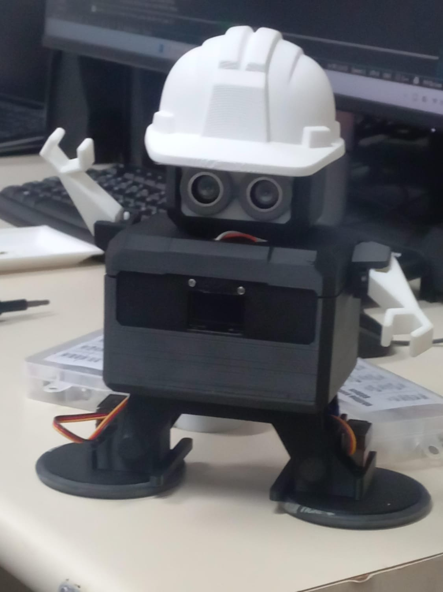

<div align="center">

# 🤖 Otto Ninja Web Control

### INOVAMECH – Laboratório de Inovação em Mecatrônica



### Sistema Web para controle remoto do robô Otto Ninja utilizando ESP32 e comunicação Wi-Fi.

<br>


<br>

<a href="https://jonnybrunno.github.io/Otto-Ninja/">

</a>

<a href="https://ottodiy.github.io/OttoWebAppControl/">

</a>

</div>

---

# 📖 Sobre o Projeto

O **Otto Ninja Web Control – INOVAMECH Edition** é uma plataforma web desenvolvida para realizar o controle remoto do robô **Otto Ninja** por meio de um navegador de internet, utilizando comunicação via **ESP32** e rede Wi-Fi.

O projeto foi desenvolvido pelo **INOVAMECH – Laboratório de Inovação em Mecatrônica**, tendo como ponto de partida o projeto **Otto Web App Control**. Entretanto, esta versão passou por uma profunda reestruturação, deixando de ser apenas uma adaptação visual para se tornar uma nova implementação voltada às necessidades de ensino, pesquisa e extensão do laboratório.

Durante o desenvolvimento foi criada uma **nova versão (child)** do projeto, com uma identidade própria e diversas melhorias estruturais e funcionais.

---

# 🚀 Principais melhorias implementadas

✅ Nova interface gráfica desenvolvida do zero

✅ Reorganização completa do código-fonte

✅ Nova identidade visual

✅ Integração otimizada com ESP32

✅ Melhor organização dos comandos

✅ Novos modos de operação

✅ Interface mais intuitiva

✅ Código preparado para futuras expansões

✅ Adaptação para projetos acadêmicos e de pesquisa

---

# 🌐 Aplicação Online

Acesse a aplicação em:

## https://jonnybrunno.github.io/Otto-Ninja/

Projeto utilizado como referência:

## https://ottodiy.github.io/OttoWebAppControl/

---

# 🖥️ Interface

## Tela Inicial

<p align="center">

</p>

---

## Painel de Controle

<p align="center">

</p>

A interface foi completamente redesenhada para oferecer uma experiência mais intuitiva, organizada e compatível com as necessidades dos projetos desenvolvidos pelo INOVAMECH.

---

# 🔧 Hardware

Foi desenvolvido um hardware baseado em **ESP32**, responsável pela comunicação entre o robô e a aplicação Web.

## Vista Frontal

<p align="center">

</p>

---

## Vista Traseira

<p align="center">

</p>

A placa foi projetada para simplificar a integração entre os servomotores, sensores e o ESP32, proporcionando uma solução compacta e de fácil manutenção.

---

# 🎮 Funcionalidades

- Controle dos movimentos do robô

- Movimento para frente

- Movimento para trás

- Giro para esquerda

- Giro para direita

- Controle do servo da cabeça

- Modos especiais

- Comunicação Wi-Fi

- Interface Web responsiva

- Compatível com computadores

- Compatível com tablets

- Compatível com smartphones

- Integração com ESP32

---

# 📡 Como utilizar

## 1. Ligue o robô

Alimente o Otto Ninja e aguarde a inicialização do ESP32.

---

## 2. Conecte-se à rede

Conecte seu computador ou smartphone à mesma rede do ESP32.

---

## 3. Abra o navegador

Acesse:

```
https://jonnybrunno.github.io/Otto-Ninja/
```

---

## 4. Informe o endereço IP

Digite o endereço IP do robô.

Exemplo:

```
http://172.27.23.109/
```

---

## 5. Controle o robô

Após a conexão, utilize os comandos disponíveis na interface para controlar o Otto Ninja.

---

# 🧰 Tecnologias Utilizadas

- HTML5

- CSS3

- JavaScript

- ESP32

- Wi-Fi

- GitHub Pages

---

# 🎓 Aplicações

Este projeto vem sendo utilizado em atividades de:

- Robótica Educacional

- Sistemas Embarcados

- Internet das Coisas (IoT)

- Automação

- Programação

- Projetos Maker

- Pesquisa Científica

- Extensão Universitária

---

# 🏛️ Desenvolvido por

<div align="center">

# INOVAMECH

## Laboratório de Inovação em Mecatrônica

*"Desenvolvendo soluções tecnológicas para educação, pesquisa e inovação nas áreas de robótica, automação e sistemas inteligentes."*

</div>

---

# 📂 Estrutura do Projeto

```
Otto-Ninja
│
├── css/
│
├── js/
│
├── images/
│   ├── otto-ninja-capa.jpg
│   ├── interface-home.png
│   ├── interface-control.png
│   ├── esp32-front.jpg
│   └── esp32-back.jpg
│
├── index.html
│
└── README.md
```

---

# 📜 Créditos

Este projeto foi desenvolvido pelo **INOVAMECH – Laboratório de Inovação em Mecatrônica**.

A versão atual foi baseada no projeto **Otto Web App Control**, porém recebeu uma ampla reestruturação de arquitetura, interface e funcionalidades, resultando em uma implementação própria, adaptada às necessidades dos projetos desenvolvidos pelo laboratório.

---

# 📌 Links

## 🌐 Aplicação

https://jonnybrunno.github.io/Otto-Ninja/

## 🔗 Projeto de Referência

https://ottodiy.github.io/OttoWebAppControl/

---

<div align="center">

### ⭐ Se este projeto foi útil para você, deixe uma estrela no repositório!

**INOVAMECH – Laboratório de Inovação em Mecatrônica**

</div>
